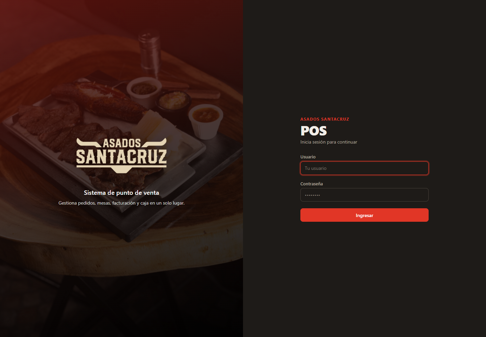
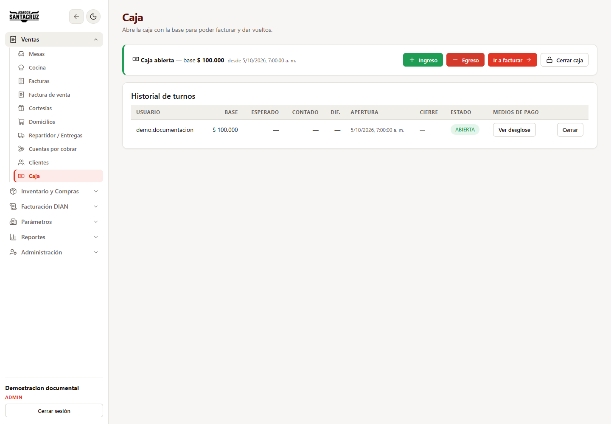
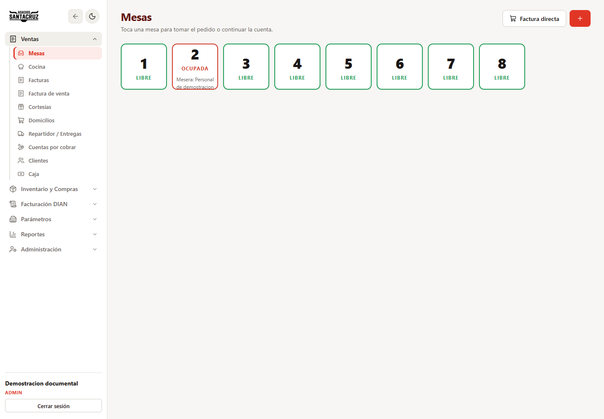
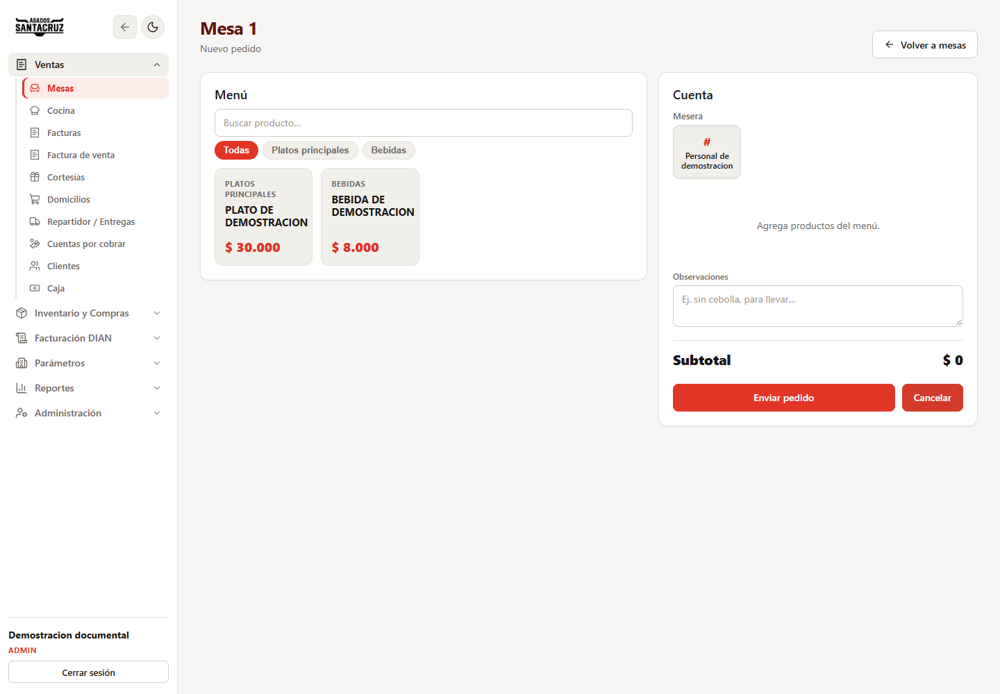
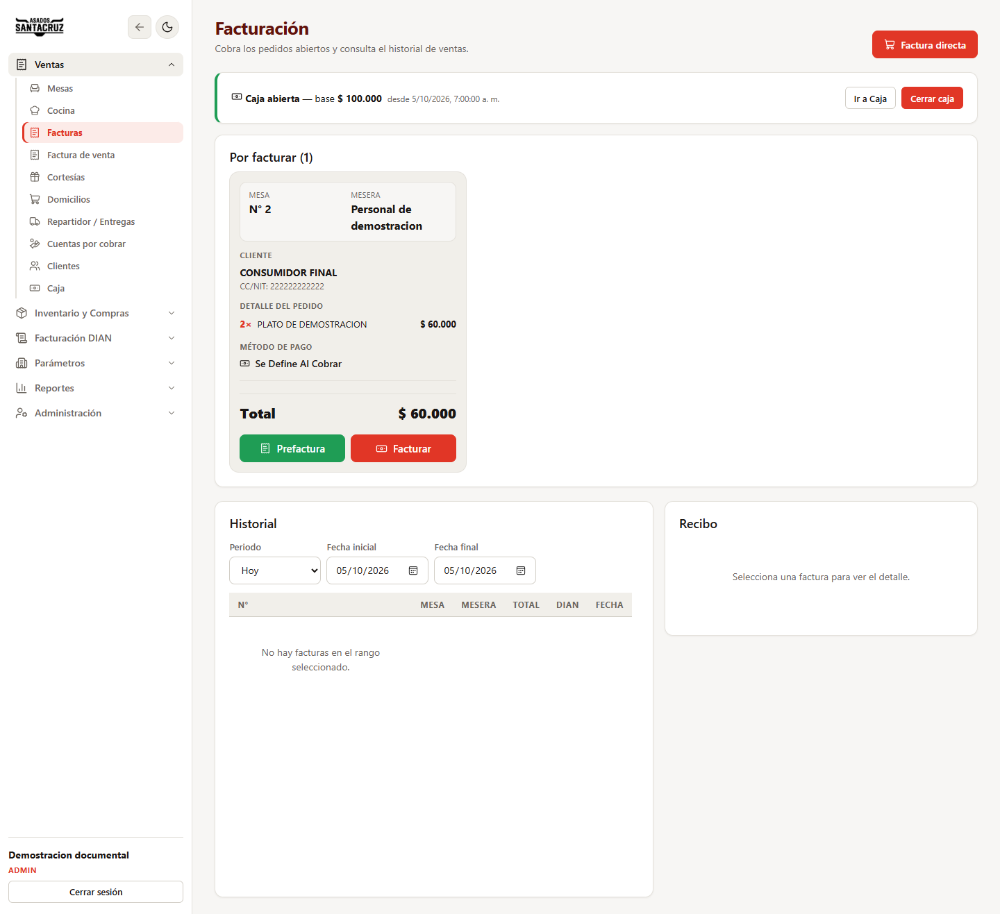
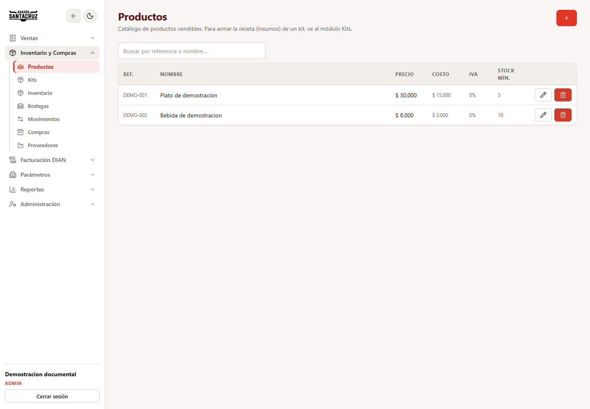
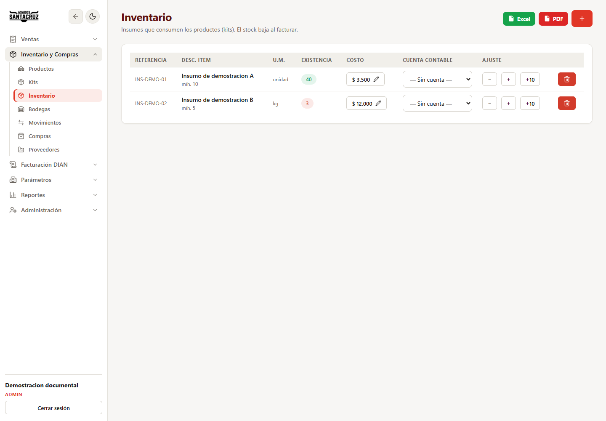
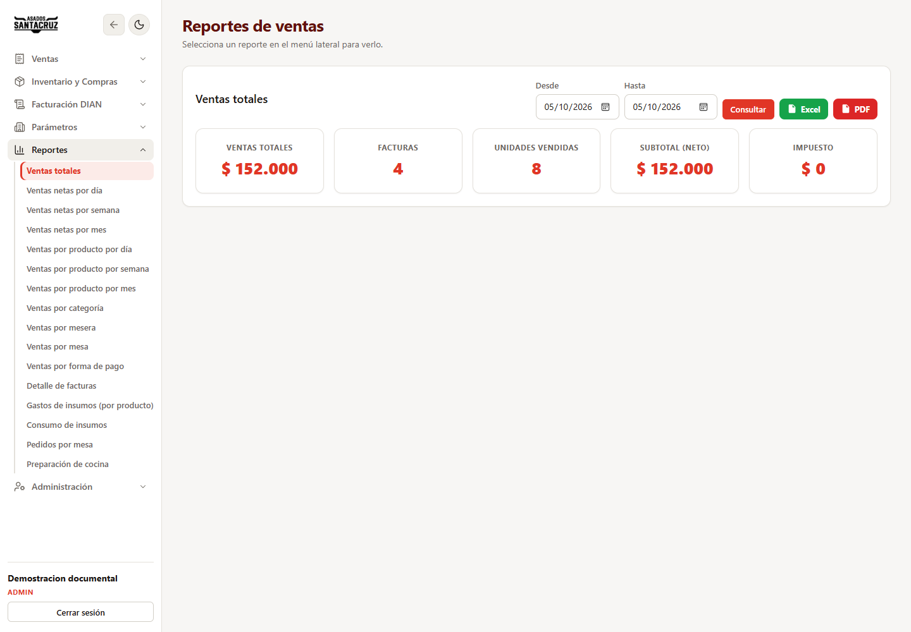

# SANTACRUZ POS
## Manual de usuario

Edicion documental: 5 de octubre de 2026. Alcance: interfaz y funciones identificadas en el codigo del proyecto disponible para esta entrega.

### Presentacion

Este manual explica las tareas habituales de administracion y operacion del punto de venta. Los menus y botones disponibles dependen de los permisos de cada usuario. La instalacion, las credenciales del proveedor electronico y la administracion de la base de datos corresponden al responsable tecnico.

La interfaz fotografiada muestra la marca Asados Santacruz; los identificadores internos del proyecto utilizan EASYPOS. SANTACRUZ POS es la denominacion solicitada para este documento. El titular debe confirmar esa correspondencia antes de presentar el registro.

**Alcance de las imagenes:** las ocho capturas muestran la interfaz real del proyecto ejecutada localmente con datos ficticios suministrados en el navegador. No se conecto esta demostracion a PostgreSQL ni a Factus. Las imagenes no acreditan ventas, autenticacion contra el servidor ni aceptacion tributaria. Los ejemplos de distintas pantallas no constituyen una conciliacion contable.

### Indice

1. Requisitos y acceso.
2. Navegacion y perfiles.
3. Preparacion inicial del negocio.
4. Apertura, movimientos y cierre de caja.
5. Mesas y toma de pedidos.
6. Operacion de cocina.
7. Domicilios y entregas.
8. Clientes y cuentas por cobrar.
9. Facturacion y documentos electronicos.
10. Productos, insumos y kits.
11. Bodegas, movimientos y compras.
12. Reportes y exportaciones.
13. Administracion y auditoria.
14. Solucion de problemas.
15. Buenas practicas y glosario.
16. Relacion de capturas y limites de verificacion.

### 1. Requisitos y acceso

Para operar se necesita un navegador actualizado, la direccion de la instalacion, una cuenta habilitada y conectividad con el servidor. La emision electronica necesita ademas comunicacion del servidor con el proveedor configurado. El mapa y la ubicacion dependen de los permisos del navegador y de la disponibilidad de los servicios asociados.

1. Abra la direccion que entregue el administrador.
2. Si aparece el selector Restaurante, compruebe que corresponde a su negocio.
3. Escriba su usuario y contrasena.
4. Pulse **Ingresar**.
5. Verifique su identidad en el menu. Un cajero con permiso para abrir caja puede ingresar directamente a Caja.

Si el sistema informa que la sesion ha expirado, inicie sesion nuevamente. No comparta cuentas ni contrasenas. Si no puede acceder, solicite al administrador la verificacion de su cuenta; este manual no establece un procedimiento de recuperacion automatica.

Figura 1. Acceso a la interfaz. Demostracion local; no se introdujeron credenciales reales.

### 2. Navegacion y perfiles

El menu agrupa **Ventas**, **Inventario y Compras**, **Facturacion DIAN**, **Parametros**, **Reportes** y **Administracion**. Abra el grupo y seleccione la opcion requerida. En pantallas pequenas, abra el menu mediante su boton. Puede cambiar el tema visual con el control de dia/noche y terminar su trabajo con **Cerrar sesion**.

Los iconos de agregar, editar, quitar e imprimir se identifican por el contexto y, cuando estan disponibles, por su texto emergente al pasar el puntero. No confunda quitar una linea de un formulario con eliminar un registro ya guardado.

Los siguientes son perfiles de uso orientativos, no una lista de roles obligatorios o permisos predeterminados:

| Perfil operativo | Tareas habituales |
| --- | --- |
| Administracion | Parametros, usuarios, permisos y consultas generales |
| Caja | Apertura, cobro, movimientos y cierre autorizados |
| Servicio de mesa | Seleccion de mesa y registro de pedidos |
| Cocina | Consulta de comandas y marcado de preparaciones listas |
| Inventario y compras | Insumos, recetas, existencias y compras |
| Reparto | Estados de entrega y ubicacion autorizada |

Si una opcion no aparece, solicite la revision del rol y los permisos. Despues de un cambio de permisos, cierre e inicie sesion para actualizar el menu.

### 3. Preparacion inicial del negocio

Antes de la primera venta, el administrador debe revisar:

- **Empresa:** identificacion del emisor y formatos de impresion disponibles.
- **Parametros:** companias, centros de operaciones, categorias y asignacion de cajas que utilice la instalacion.
- **Tipos de documentos:** clase, estado activo, prefijo y rango de consecutivos.
- **Resoluciones:** informacion aplicable a la numeracion de facturacion.
- **Productos:** precios, impuestos, unidades y disponibilidad.
- **Inventario y kits:** insumos, existencias iniciales y cantidades de las recetas.
- **Clientes, proveedores y medios de pago:** datos requeridos por la operacion.
- **Usuarios y roles:** permisos para cada tarea.

La facturacion exige un tipo de documento correspondiente a la clase de venta, activo, con prefijo y rango valido. Un consecutivo agotado o fuera del rango impide utilizar ese tipo. No utilice una numeracion de demostracion en una instalacion productiva.

Las credenciales de Factus se configuran en el servidor por el responsable tecnico. No se deben incluir en este manual ni en pantallazos.

### 4. Apertura, movimientos y cierre de caja

**Abrir un turno**

1. Entre a **Ventas > Caja**.
2. Compruebe que la caja este configurada y que no haya un turno abierto.
3. Pulse **Abrir caja** si tiene permiso.
4. Registre el valor inicial o base y confirme la apertura.
5. Verifique que aparezcan el estado de caja abierta y el valor de la base.

Si no existe caja, un usuario autorizado puede crearla desde la pantalla. La vista actual trabaja con la primera caja disponible; la asignacion y los permisos deben revisarse en la instalacion antes de interpretar que existe operacion simultanea de multiples cajas en esta pantalla.

**Registrar entradas o salidas**

1. En el turno abierto, seleccione **Ingreso** o **Egreso**.
2. Registre monto y motivo; en egresos, revise la cuenta contable solicitada por el formulario.
3. Confirme y revise el movimiento en el desglose del turno.

**Cerrar un turno**

1. Termine los cobros del turno y revise **Ver desglose**.
2. Pulse **Cerrar caja** con una cuenta autorizada.
3. Revise el resumen del modal e ingrese los valores de conteo solicitados.
4. Compare lo esperado con lo contado antes de confirmar.
5. Verifique el estado cerrado en el historial y revise cualquier diferencia.

El historial muestra usuario, base, esperado, contado, diferencia, fechas y estado cuando esos datos estan disponibles. No registre ingresos manuales para duplicar valores ya contabilizados por una venta.

Figura 2. Ejemplo ficticio de caja abierta con base de COP 100.000 y opciones de movimiento y cierre.

### 5. Mesas y toma de pedidos

**Consultar mesas**

1. Abra **Ventas > Mesas**.
2. Identifique la mesa y su estado: libre, ocupada o plato listo, segun la operacion.
3. Seleccione la mesa para tomar un pedido o continuar una cuenta abierta.

La creacion de mesas mediante el boton de agregar solicita autorizacion con contrasena de administrador. No comparta esa contrasena con el personal operativo.

Figura 3. Ocho mesas de ejemplo; la mesa 2 tiene un pedido ficticio abierto.

**Crear un pedido**

1. Seleccione una mesa libre.
2. Elija el personal de servicio en el selector disponible.
3. Busque productos o filtre por categoria.
4. Agregue los productos y ajuste cantidades con los controles de suma y resta.
5. Registre observaciones relevantes para la preparacion.
6. Revise las lineas y el subtotal.
7. Pulse **Enviar pedido**.
8. Compruebe la confirmacion y consulte el pedido registrado.

**Modificar un pedido enviado**

Abra la mesa ocupada y habilite la edicion mediante la opcion disponible. Revise cantidades y observaciones; use **Reenviar pedido** para comunicar los cambios. La pantalla tambien contempla cambio de mesa, cancelacion y documentos impresos segun el estado. Antes de cancelar o trasladar, compruebe que selecciono el pedido correcto y coordine con caja y cocina.

La comanda informa la preparacion. La precuenta es informativa y no reemplaza una factura. Si la impresion falla, primero verifique si el pedido quedo guardado antes de enviarlo nuevamente.

Figura 4. Seleccion de productos para una mesa libre, con catalogo y controles del pedido. Datos ficticios.

### 6. Operacion de cocina

1. Entre a **Ventas > Cocina**.
2. Consulte los pedidos abiertos y sus productos e ingredientes disponibles.
3. Revise mesa, cantidades y observaciones antes de preparar.
4. Seleccione el cocinero cuando la vista lo permita.
5. Cuando termine, pulse **Plato listo** y confirme.
6. Coordine la entrega con el personal de servicio.

Marcar una preparacion como lista no equivale a cobrar ni facturar. Si el pedido cambia despues de prepararse, revise la nueva comanda y las observaciones.

### 7. Domicilios y entregas

**Registrar un domicilio**

1. Abra **Ventas > Domicilios**.
2. Seleccione productos y cantidades.
3. Complete los datos de cliente, contacto y entrega requeridos.
4. Registre la ubicacion cuando corresponda y el navegador lo permita.
5. Revise el pedido y confirme su envio.
6. Conserve la referencia para consultar el seguimiento.

**Gestionar la entrega**

1. Abra **Repartidor / Entregas** y seleccione el pedido.
2. Actualice el estado real: **En preparacion**, **En camino** o **Entregado**.
3. Use **Iniciar entrega y compartir ubicacion** solo con autorizacion y durante el servicio.
4. Detenga la comparticion cuando corresponda y verifique el estado final.

La ubicacion depende del GPS, permisos del navegador y conectividad. Una ubicacion ausente no demuestra que el pedido no exista; consulte tambien su estado y los datos de contacto. No utilice el seguimiento para vigilancia ajena a la entrega.

### 8. Clientes y cuentas por cobrar

En **Clientes**, cree o actualice la informacion de identificacion, nombre o razon social, contacto, direccion y municipio que solicite el formulario. Para emision electronica, revise los datos tributarios del receptor con especial cuidado.

Si el cliente opera a credito, revise condicion, plazo y cupo disponibles antes de facturar. No seleccione credito solo para omitir el registro de un pago de contado.

Para consultar cartera:

1. Abra **Ventas > Cuentas por cobrar**.
2. Localice el cliente y las obligaciones pendientes.
3. Revise el saldo antes de registrar un abono.
4. Complete importe y medio de pago en la opcion de abono.
5. Confirme y verifique el nuevo saldo.

Evite duplicar un abono por una respuesta lenta. Si hay un error, consulte el historial antes de repetir la operacion.

### 9. Facturacion y documentos electronicos

**Facturar un pedido**

1. Compruebe que la caja este abierta y exista el tipo de documento requerido.
2. Abra **Ventas > Facturas**.
3. Localice el pedido en **Por facturar** y seleccione el cobro.
4. Revise cliente, productos, cantidades, total y servicio voluntario cuando corresponda.
5. Seleccione el medio de pago y los valores recibidos, o la condicion de credito autorizada.
6. Confirme una sola vez y espere la respuesta.
7. Verifique la factura en el historial y su estado electronico.
8. Imprima el comprobante cuando corresponda.

**Factura directa:** utilice **Factura directa** para construir la venta sin partir de un pedido de mesa; revise productos y cobro antes de confirmar.

**Factura de venta:** esta opcion del menu utiliza la variante no electronica de la pantalla de facturacion. No equivale a una factura electronica aceptada por la DIAN, aunque comparta datos y funciones de cobro.

Figura 5. Pantalla de facturacion con un pedido ficticio pendiente. No se emitio ni se transmitio una factura para esta captura.

**Comprobar el envio electronico**

La integracion del servidor utiliza Factus. Una factura creada localmente no debe considerarse aceptada solo porque tiene numero o puede imprimirse. Revise el estado mostrado y los datos de respuesta disponibles.

- **ACEPTADA:** el sistema registra la aceptacion informada por la integracion; compruebe la referencia y los datos electronicos disponibles.
- **NO_APLICA:** documento interno o no electronico, no evidencia de validacion DIAN.
- Otros estados o errores: revise el detalle antes de entregar el documento como aceptado.

Si aparece la opcion de reenvio a la DIAN, utilicela despues de resolver el motivo del fallo y revisar si ya existe una aceptacion. No cree otra venta para compensar un fallo de transmision.

**Notas y retenciones**

En **Facturacion DIAN**, consulte Resoluciones, Notas credito, Notas debito y Retenciones segun sus permisos. Seleccione el documento relacionado y complete el motivo y los valores exigidos. Verifique el efecto registrado sobre factura y saldo.

Existe un adaptador electronico para notas credito. No se afirma en este manual que notas debito o retenciones se transmitan electronicamente. Una correccion requiere revision administrativa; no sustituya una factura aceptada editando sus datos informalmente.

### 10. Productos, insumos y kits

**Productos**

1. Abra **Inventario y Compras > Productos**.
2. Use el boton de agregar para un nuevo registro o el icono de editar para uno existente.
3. Complete referencia, nombre, precio, categoria y demas campos aplicables, como impuesto, unidad, costo, codigo de barras y descripcion.
4. Guarde y compruebe el producto mediante la busqueda por referencia o nombre.

La foto es opcional; la pantalla limita su tamano a 1,5 MB. Revise precios e impuestos antes de habilitar ventas. No elimine productos historicos sin comprobar las restricciones y necesidades de trazabilidad.

Figura 6. Catalogo con dos referencias y precios ficticios para ilustrar consulta y mantenimiento.

**Insumos**

En **Inventario**, registre codigo, nombre, unidad, stock minimo y costo segun el formulario. Consulte stock y estado de disponibilidad; la vista marca como bajo el stock menor o igual al minimo. Revise las unidades antes de interpretar cantidades: una unidad y un kilogramo no son equivalentes.

Puede exportar el inventario mediante los controles **Excel** y **PDF**. La salida PDF utiliza la impresion del navegador.

Figura 7. Ejemplo ficticio de existencias; el segundo insumo esta por debajo del minimo configurado.

**Kits o recetas**

1. Abra **Inventario y Compras > Kits**.
2. Seleccione un producto previamente creado.
3. Agregue sus insumos y las cantidades que consume cada unidad vendida.
4. Compruebe que unidades y cantidades correspondan a la receta real.
5. Pulse **Guardar kit** y revise la composicion.

Editar o quitar una receta afecta el calculo relacionado con sus insumos. La utilidad estimada en reportes depende de recetas y costos; un producto sin receta puede aparecer con costo de insumos igual a cero, lo que no significa costo real nulo.

En los pedidos de restaurante, los insumos se descuentan al registrar el pedido, no de nuevo al cobrarlo. Una factura directa realiza su propio descuento. Si modifica o cancela, consulte los movimientos de salida o reversion que correspondan; no compense manualmente antes de revisar lo que el sistema ya registro.

### 11. Bodegas, movimientos y compras

En **Bodegas**, mantenga las ubicaciones de almacenamiento que utilice el negocio. En **Movimientos**, revise entradas, salidas y ajustes, verificando producto o insumo, cantidad, bodega y referencias disponibles. No corrija diferencias de stock modificando directamente la base de datos.

Para registrar compras:

1. Cree o verifique el proveedor en **Proveedores**.
2. Entre a **Compras** y seleccione la opcion de nueva compra.
3. Seleccione proveedor y complete los datos del encabezado.
4. Agregue las lineas de insumos, cantidades y costos.
5. Revise el total y pulse **Registrar**.
6. Verifique la compra y el inventario afectado.

Use los filtros de fecha y proveedor para localizar compras. Las opciones de editar y eliminar dependen de permisos; revise sus efectos sobre existencias antes de confirmarlas. El movimiento de una operacion debe comprobarse en el sistema, no deducirse solo de la impresion de un documento.

### 12. Reportes y exportaciones

1. Abra **Reportes** y seleccione el informe del menu.
2. Defina las fechas **Desde** y **Hasta**.
3. Pulse **Consultar** y compruebe el periodo.
4. Revise totales o detalle segun el reporte.
5. Use **Excel** para descargar una hoja de calculo o **PDF** para abrir la salida imprimible.
6. Para guardar PDF desde el dialogo de impresion, seleccione una impresora PDF disponible en su equipo.

La aplicacion contempla ventas totales y netas por periodo, productos, categorias, mesera, mesa, forma de pago, detalle de facturas, gastos y consumo de insumos, pedidos por mesa y preparacion de cocina. La pantalla tambien contempla compras por insumo; su acceso depende de las opciones expuestas en la version de navegacion.

Las fechas comerciales se interpretan con la logica de Colombia. Verifique rango, notas y retenciones antes de comparar reportes con caja. La estimacion de utilidad por insumos no equivale a utilidad contable completa: puede excluir otros gastos del negocio.

Figura 8. Resumen ficticio de ventas con fechas y controles de exportacion. No corresponde a una operacion real.

### 13. Administracion y auditoria

En **Administracion > Usuarios**, gestione las cuentas autorizadas. En **Roles y permisos**, revise modulos, submodulos y acciones. Otorgue solo los accesos necesarios; no asigne privilegios administrativos a todo el personal para resolver un menu ausente.

En **Auditoria**, consulte los eventos registrados y los filtros disponibles. La presencia de un modulo de auditoria no garantiza que cualquier accion o lectura quede registrada: el alcance depende de los eventos implementados.

La gestion de restaurantes pertenece a la plataforma y debe realizarla un usuario autorizado. Confirme el negocio seleccionado antes de operar y no altere conexiones de base de datos desde procedimientos informales.

### 14. Solucion de problemas

| Situacion | Comprobacion y accion |
| --- | --- |
| No puedo ingresar | Revisar usuario, restaurante y conexion; solicitar revision de cuenta al administrador |
| Falta un menu o boton | Revisar rol y permiso; cerrar e iniciar sesion despues de un cambio |
| Sesion expirada | Iniciar sesion nuevamente; comprobar el resultado de una operacion anterior antes de repetirla |
| No puedo facturar | Revisar caja abierta, permiso y tipo de documento activo con rango disponible |
| Falla el envio electronico | Consultar estado y detalle; revisar con el responsable tecnico credenciales, ambiente y proveedor |
| No imprime | Permitir ventanas emergentes para el sitio; revisar impresora y formato; comprobar que el registro ya existe |
| No aparece una venta | Revisar fechas, clase de documento, filtros y estado de la operacion |
| Stock inesperado | Revisar unidades, receta, bodega, compras y movimientos; reportar diferencias |
| Reporte sin datos | Revisar rango y registros existentes; no interpretar la ausencia como ventas iguales a cero sin comprobar |
| Mapa o ubicacion ausente | Revisar permiso de ubicacion, GPS, conexion y datos de entrega |

Ante un error, anote modulo, fecha, referencia del documento y mensaje, y contacte al responsable. Evite adjuntar documentos de clientes o secretos sin proteccion. No vuelva a confirmar pagos, facturas o pedidos hasta comprobar si el primer intento se registro.

### 15. Buenas practicas y glosario

- Compruebe caja y numeracion antes de iniciar ventas.
- Revise los datos del cliente antes de emitir documentos electronicos.
- Registre observaciones claras y solo datos necesarios.
- Mantenga recetas, costos y unidades actualizados.
- Concilie caja y cartera al terminar el turno.
- Cierre sesion al dejar un equipo compartido.
- Solicite respaldos verificados al responsable tecnico; no ejecute sembrados o reinicializaciones sobre datos existentes.

| Termino | Significado |
| --- | --- |
| POS | Sistema de punto de venta |
| Comanda | Informacion de un pedido para su preparacion |
| Precuenta | Resumen informativo previo al cobro; no reemplaza factura |
| Kit | Producto compuesto por insumos y cantidades definidas |
| Base de caja | Valor inicial del turno |
| Abono | Pago parcial aplicado a una obligacion |
| Consecutivo | Numero asignado dentro de un rango documental |
| DIAN | Autoridad tributaria colombiana |
| Factus | Servicio externo utilizado por la integracion electronica |
| CUFE | Codigo unico de factura electronica, cuando el documento lo tiene |
| Tenant | Contexto de restaurante usado por la plataforma |

### 16. Relacion de capturas y limites de verificacion

| Figura | Archivo | Pantalla |
| --- | --- | --- |
| 1 | 01-acceso.png | Acceso |
| 2 | 02-caja.png | Caja |
| 3 | 03-mesas.png | Mesas |
| 4 | 04-toma-pedido.png | Toma de pedido |
| 5 | 07-facturacion.png | Facturacion |
| 6 | 05-productos.png | Productos |
| 7 | 06-inventario.png | Inventario |
| 8 | 08-reportes.png | Reportes |

Las imagenes se obtuvieron del cliente sin modificar sus componentes ni activar el bypass de autenticacion del codigo. Se suministro una sesion ficticia solo al navegador automatizado y se simularon respuestas de consulta; las escrituras quedaron bloqueadas. Se verifico el renderizado de las pantallas, no la autenticacion real, la persistencia de ventas, la emision DIAN, la impresion fisica ni el seguimiento GPS real.

Los pasos no fotografiados se describen a partir de su implementacion disponible y requieren validacion operativa por el responsable de la instalacion. Antes de radicar, complete autor, titular, version de entrega y fechas reales de la obra; consulte la [descripcion tecnica](Descripcion-tecnica-SANTACRUZ-POS.md) y revise los requisitos de la autoridad de registro.